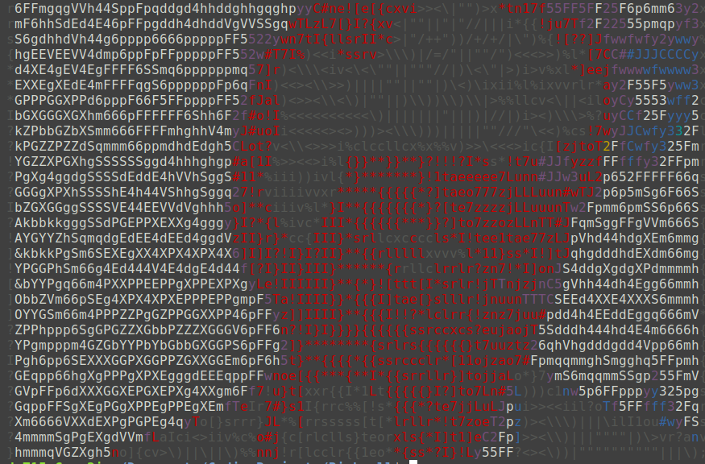

# Video to ascii
Usage: `./generate.sh <.mp4 file> <optional percentage>`

This will generate the executable `ascii_video`, which will play the .mp4 file in ascii.

You can also use `play.sh` to play from the `ascii_video_frames.txt` file.

## Steps
`vid_to_ascii.py` uses OpenCV and ascii_magic, which you can install from requirements.txt.
It generates `ascii_video_frames.txt` which is a very large file containing all of the video's frames in ascii.

Because it's a huge file, it is compressed with `gzip`. So it can be linked with C, its turned into a binary object `ascii_video_frames.o`.

We `sed` the uncompressed file size into C, and then compile it.

Now you should have a wonderful `ascii_video` executable to send to your friends (and enemies). The default one in this repo is a rickroll.

